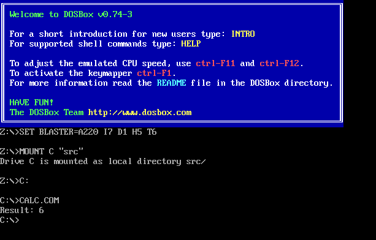

# Summary

It is a homework # 1 for GoIT Computer Systems.

## 1. Assembly

Assembled code: [calc.asm](src/calc.asm)
Resulting command: [calc.com](assets/calc.com)



## 2. Interpreter

See: [interpreter.py](src/interpreter.py)

## Prerequisites

- [mise](https://mise.jdx.dev/getting-started.html) installed and activated in your shell (for example `eval "$(mise activate bash)"` for Bash).

Python is pinned via [mise.toml](mise.toml) (default **3.12**, overridable with `PYTHON_VERSION`). The repo also carries `[.python-version](.python-version)` for tooling that reads it.

## Quick start

1. **Trust and install tools** (from the repo root):
  ```bash
   mise trust
   mise install
  ```
   This installs **Python**, **uv**, and **ruff**, and with `python.uv_venv_auto` manages `[.venv](.venv)`.
2. **Install dependencies** (from [pyproject.toml](pyproject.toml) + [uv.lock](uv.lock)):
  ```bash
   uv sync
  ```
3. **Run interpreter script**:
  ```bash
  python src/interpreter.py
  ```

## Layout

- `**src/**` - application code (document with docstrings; Sphinx autodoc is configured in [docs/source/conf.py](docs/source/conf.py) with the project root and `src/` on `sys.path`).
- `**tests/**` - tests; run with pytest.
- `**docs/**` - documentation; generated by Sphinx.

## Common commands


| Goal                        | Command                                   |
| --------------------------- | ----------------------------------------- |
| Run tests                   | `mise run test` or `uv run pytest tests/` |
| Lint `src/`                 | `mise run lint`                           |
| Project / venv info         | `mise run info`                           |
| Regenerate Sphinx API stubs | `mise run generate-docs` (`mise run gd`)  |
| Build HTML docs             | `mise run build-docs` (`mise run bd`)     |
| Install pre-commit hooks    | `mise run pre-commit-install`             |


HTML output goes to `**docs/build/**` (open `docs/build/index.html` after a build).

After `sphinx-apidoc` adds `.rst` files under [docs/source](docs/source), include them in the `toctree` in [docs/source/index.rst](docs/source/index.rst) so they appear in the built site.

## Workflow

1. Configure mise, run `**uv sync**`, then `**mise run pre-commit-install**`.
2. Implement code under `**src/**` and tests under `**tests/**`, using docstrings where useful.
3. Run `**mise run lint**` and `**mise run test**`.
4. Run `**mise run generate-docs**` then `**mise run build-docs**` when you want refreshed API documentation.

## License

See [LICENSE](LICENSE).